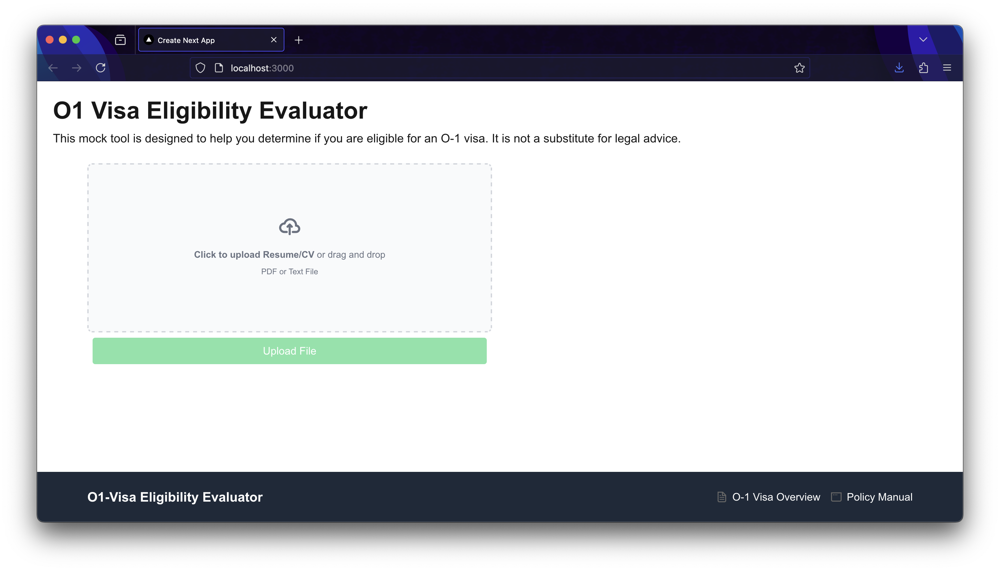

# Mock Visa Application

Mock design for an application that might be able to assess Visa eligibility based on an inputed resume.

 

## Usage

Run FastAPI backend server:

```bash
poetry install
export OPENAI_API_KEY="..."
# Starts on 0.0.0.0:8072 by default
poetry run python visa_mock/server --ip=... --port=...
```

Run Web Client:

```bash
cd visa-mock-client
# Runs on localhost:3000
npm run start
```
