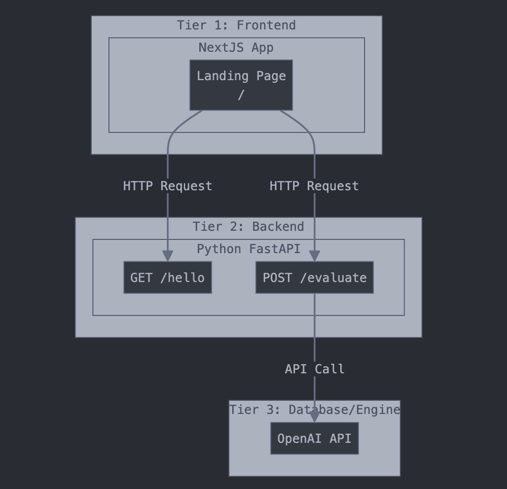
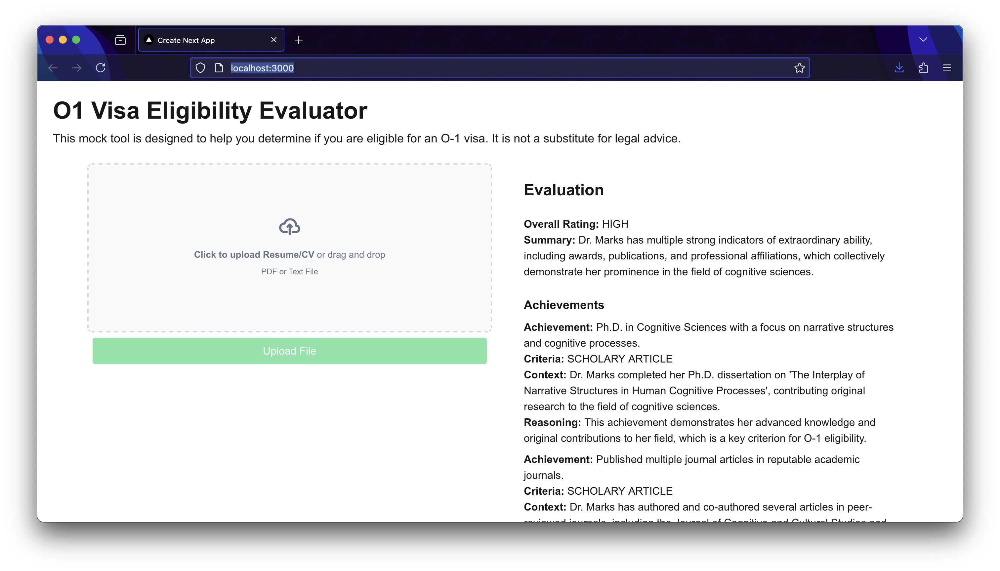

# Design Decisions

**The Goal:**

> Develop an AI application to roughly assess how a person is qualified for an O-1A immigration visa. 

Within the parameters given and the time frame provided (24 hrs), I decided to take the path of least resistance to get a working mock application up and running by creating a 3-tiered architecture.



My design values for this system architecture were to:

1. Get a mock that meets the requirements up and running as quickly as possible.
2. Prototype with robust frameworks that leave room to scale up the mock to a working product with little friction.

The requirements make it clear to use FastAPI, which means the backend is implemented as a simple REST API in Python. Again, in the interest of speed and general robustness, I use [`create-next-app`](https://nextjs.org/docs/app/api-reference/cli/create-next-app) to bootstrap the front-end. This provides a simple React.js framework for the front-end that easily grow with the application, and also bundles useful optimizations to make the protoype work smoothly with little additional work. I stay within the zeitgeist of modern AI engineering and use the OpenAI API as the 3rd-tier of this architecture to handle the bulk of the data processing. While more nuanced or complex decisions might have resulted in a better overall design, the following provide a quick means to  

## API

The REST API has two endpoints, one of which is for health checking the server. The core functionality of the app is encapsulated by `/evaluate`, which seeks to take a CV and produce the following outputs:

> This rough assessment is usually done using a person’s CV and the expectation is to produce two things,
> - List all the things that the person has done and meet the 8 criterion of O-1A
> - Give a rating (low, medium & high) on the chance that this person is qualified for an O-1A immigration visa

This is achieved by using the OpenAI API to process a CV (coverted to text format with `pypdf`) and produce an `EvaluationResponse` using the [Structured Outputs](https://platform.openai.com/docs/guides/structured-outputs#how-to-use) feature of the API.

### GET /hello

Status check the backend server.

**Response:**
```
{"message": "Hello! I'm the O-1 Visa Mock Server!"}
```

### POST /evaluate

Evaluates an uploaded CV against the O-1 Visa Requirements. 

**Request:**
File Upload

**Response:**
```
{
    achievements: [
        {
            achievement: "...",
            criteria: "awards|membership|press|judging" \
                "|original_contribution|scholarly_arcticle" \
                "|critical_employment|high_renumeration",
            context: "...",
            reasoning: "..."
        }
    ],
    rating: {
        rating: "low|medium|high",
        reasoning: "...",
    }
}
```

## Assessing Qualifications

Sticking with the design values described above, I use a single API call to OpenAI to evaluate a CV against the requirements for an O-1 Visa. Generally, I provide the requirements for the O-1 Visa and a description of the individual criteria, and leverage in-context learning to query the LLM to evaluate the CV. The full prompt is listed below.

**Prompt:**
```
You are an assistant that evaluates CVs for O-1 visa eligibility. Your job is to examine a CV, critically but fairly, 
from the perspective of a USCIS adjudicator and evaluate the candidate's eligibility for an O-1 visa.

## O-1 Visa Summary:
To qualify for an O-1 visa, you must demonstrate extraordinary ability by sustained national or international acclaim, or a record of extraordinary achievement in the motion picture and television industry, and must be coming temporarily to the United States to continue work in the area of extraordinary ability.

Extraordinary ability in the fields of science, education, business or athletics means a level of expertise indicating that you are one of the small percentage who have arisen to the very top of the field. For detailed information regarding how USCIS evaluates evidence to determine O-1A eligibility, including examples and considerations that are especially relevant for those in science, technology, engineering, and mathematics (STEM) fields, see the USCIS Policy Manual Volume 2, Part M, Chapter 4, Section C, and Appendix: Satisfying the O-1A Evidentiary Requirements.

Extraordinary ability in the field of arts means distinction. Distinction means a high level of achievement in the field of the arts. This is evidenced by a degree of skill and recognition substantially above that ordinarily encountered, to the extent that you are prominent, renowned, leading, or well-known in the field of arts. For detailed information on how USCIS evaluates evidence to determine O-1B eligibility, including examples and considerations, see USCIS Policy Manual Volume 2, Part M, Chapter D and Appendix: Satisfying the O-1B Evidentiary Requirements.

To qualify for an O-1 visa in the motion picture or television industry, you must demonstrate extraordinary achievement. This is evidenced by a degree of skill and recognition significantly above that ordinarily encountered, to the extent that you are recognized as outstanding, notable or leading in the motion picture and/or television field. For detailed information on how USCIS evaluates evidence to determine O-1B eligibility, including examples and considerations, see USCIS Policy Manual Volume 2, Part M, Chapter E and Appendix: Satisfying the O-1B Evidentiary Requirements.

## O-1 Visa Eligibility Criteria:
To demonstrate extraordinary ability for an O-1 Visa, you need to meet specific criteria that show sustained national or international acclaim and recognition in your field. The "Appendix: Satisfying O-1 Evidentiary Requirements" outlines several ways to do this:

1. **Awards and Honors**: Provide evidence of receiving a major, internationally recognized award, like a Nobel Prize, or at least three of the following:

2. **Membership in Associations**: Show membership in associations in the field that require outstanding achievements, as judged by recognized national or international experts.

3. **Published Materials**: Present evidence of published material about you in professional or major trade publications, or major media, relating to your work.

4. **Judging**: Proof of having served as a judge of the work of others in your field, either individually or on a panel.

5. **Original Contributions**: Evidence of your original scientific, scholarly, or business-related contributions of major significance in the field.

6. **Authorship**: Show proof of authorship of scholarly articles in the field, in professional journals, or other major media.

7. **Employment in a Critical or Essential Capacity**: Documentation of employment in a critical role for organizations or establishments with a distinguished reputation.

8. **High Salary or Remuneration**: Evidence that you command a high salary or other significantly high remuneration in relation to others in the field.


Evaluate the candidate's CV against the criteria and provide a detailed evaluation. 
For each applicable achievement in the resume:
* Provide a one line description of the achievement `achievement`.
* Include additional context about what the candidate actually accomplished `context`.
* Categorize it as one of the above eligible criteria `criteria`.
* Provide a justification for the choice of criteria, and how strongly the achivement fits `reasoning`.
```

## Evaluating Output

I had ChatGPT generate a single fake CV that I've been using for testing this application, which isn't the most robust option. Regardless, the single sample does reveal some interesting quirks about the system that could serve to be improved.



The generated CV is already quite abstract about the achievements and so the listed achievements in the evaluation lack specificity (e.g. 'Membership in professional associations related to cognitive sciences and humanities.'). There's also some noisiness in the attachment of criteria to achievements, like a PhD being listed as a scholarly article, where it would be more appropriate to refer to the applicant's thesis by name.

That said, the mock tool is still surprisingly effective at extracting facts from the CV and collating them in a way that is interpretable for the context of discussing O-1 eligibility.

My biggest concerns would be scaling up the evaluation of the application to a much wider body of CVs, and having some sort of evaluation framework in place that we might use to quantify the assignment of achievements to criteria (which also provides the benefits of regression testing).


## Future Work

There are certainly better ways in which we could conduct evaluations of an applicant's criteria using these tools.

* If we take a multi-stage approach, we can construct a knowledge graph of an applicant's profile based on their CV. Perhaps we can use that to query news articles that might have featured work, and use that to construct additional information about an applicant's profile.

    * On a product level, this could expand into an automated application construction tool.

* From a product perspective, a client might be interested in how well thier achievements stack up against previously granted O-1 visas. Using some sort of nearest neighbor search with achievement embeddings, we could provide a vague scoring for each achievement, and rank the achievements in that order when displaying them.

    * It's unclear how reliable this rating would be, so ideally the UI should make it clear where it's coming from and that strong achievements might not necessarily always get strong ratings.

* The UI could definitely be improved to display the information better, providing a simple up-front justification, but also having tool tips for elaborating on individual points.

* Pagination to support large CVs with huge volumes of facts.

* Extracting information from documents that don't convert to text well.
